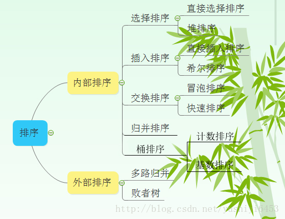
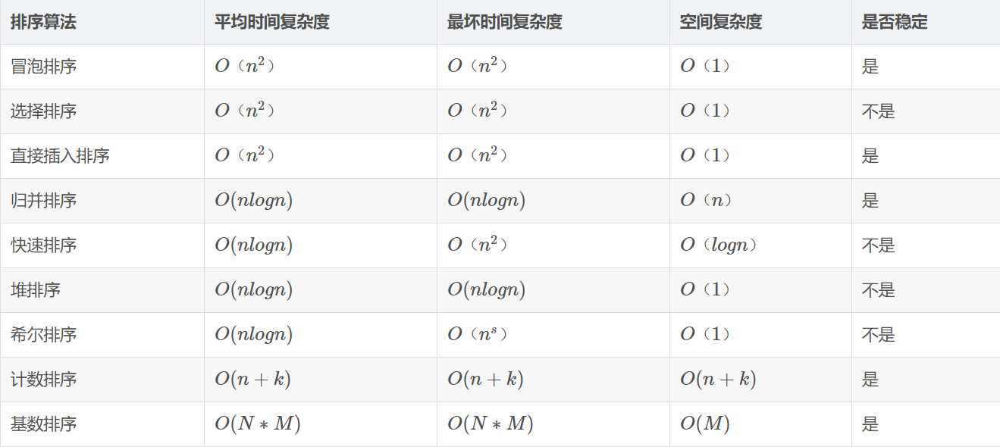

# 排序算法
## 排序算法分类     

## 排序算法比较     

注：
1 归并排序可以通过手摇算法将空间复杂度降到O(1)，但是时间复杂度会提高。
2 基数排序时间复杂度为O(N*M)，其中N为数据个数，M为数据位数。
## 辅助记忆
1. 时间复杂度记忆- 
冒泡、选择、直接 排序需要两个for循环，每次只关注一个元素，平均时间复杂度为O（n2）（一遍找元素O(n)，一遍找位置O(n)）
快速、归并、希尔、堆基于二分思想，log以2为底，平均时间复杂度为O(nlogn)（一遍找元素O(n)，一遍找位置O(logn)）
2. 稳定性记忆-“快希选堆”（快牺牲稳定性） 
排序算法的稳定性：排序前后相同元素的相对位置不变，则称排序算法是稳定的；否则排序算法是不稳定的。
## 冒泡排序
[冒泡排序](https://img-blog.csdn.net/20161009190728886)
冒泡排序从小到大排序：一开始交换的区间为0 ~ N-1，将第1个数和第2个数进行比较，前面大于后面，交换两个数，否则不交换。再比较第2个数和第三个数，前面大于后面，交换两个数否则不交换。依次进行，最大的数会放在数组最后的位置。然后将范围变为0~N-2，数组第二大的数会放在数组倒数第二的位置。依次进行整个交换过程，最后范围只剩一个数时数组即为有序。
```
//array[]为待排序数组，n为数组长度
void BubbleSort(int array[], int n)
{
    int i, j, k;
    for(i=0; i<n-1; i++)
        for(j=0; j<n-1-i; j++)
        {
            if(array[j]>array[j+1])
            {
                k=array[j];
                array[j]=array[j+1];
                array[j+1]=k;
            }
        }
}
```
## 选择排序
[选择排序](http://img.mp.itc.cn/upload/20160923/c705c53489b8455090ccb67199465387_th.jpg)
选择排序从小到大排序：一开始从0 ~ n-1区间上选择一个最小值，将其放在位置0上，然后在1~n-1范围上选取最小值放在位置1上。重复过程直到剩下最后一个元素，数组即为有序。
```
void selectSort(int array[], int n)
{
    int i, j ,min ,k;
    for( i=0; i<n-1; i++)
    {
        min=i; //每趟排序最小值先等于第一个数，遍历剩下的数
        for( j=i+1; j<n; j++) //从i下一个数开始检查
        {
            if(array[min]>array[j])
            {
                min=j;
            }
        }
        if(min!=i)
        {
            k=array[min];
            array[min]=array[i];
            array[i]=k;
        }
    }
}
```
## 插入排序
[插入排序](https://img-blog.csdn.net/20161009190855230)
插入排序从小到大排序：首先位置1上的数和位置0上的数进行比较，如果位置1上的数大于位置0上的数，将位置0上的数向后移一位，将1插入到0位置，否则不处理。位置k上的数和之前的数依次进行比较，如果位置K上的数更大，将之前的数向后移位，最后将位置k上的数插入不满足条件点，反之不处理。
```
void insertSort(int array[], int n)
{
    int i,j,temp;
    for( i=1;i<n;i++)
    {
        if(array[i]<array[i-1])
        {
            temp=array[i];
            for( j=i;array[j-1]>temp;j--)
            {
                array[j]=array[j-1];
            }
            array[j]=temp;
        }
    }
}
```
## 归并排序
[归并排序](https://img-blog.csdn.net/20161009190940095)
归并排序从小到大排序：首先让数组中的每一个数单独成为长度为1的区间，然后两两一组有序合并，得到长度为2的有序区间，依次进行，直到合成整个区间。
```
void merging(int *list1, int list1_size, int *list2,  int list2_size)
{
    int i=0, j=0, k=0, m=0;
    int temp[MAXSIZE];

    while(i < list1_size && j < list2_size)
    {
        if(list1[i]<list2[j])
        {
            temp[k++] = list1[i++];
        }
        else
        {
            temp[k++] = list2[j++];
        }
    }
    while(i<list1_size)
    {
        temp[k++] = list1[i++];
    }
    while(j<list2_size)
    {
        temp[k++] = list2[j++];
    }

    for(m=0; m < (list1_size+list2_size); m++)
    {
        list1[m]=temp[m];
    }
}
//如果有剩下的，那么说明就是它是比前面的数组都大的，直接加入就可以了 
void mergeSort(int array[], int n)
{
    if(n>1)
    {
        int *list1 = array;
        int list1_size = n/2;
        int *list2 = array + n/2;
        int list2_size = n-list1_size;

        mergeSort(list1, list1_size);
        mergeSort(list2, list2_size);

        merging(list1, list1_size, list2, list2_size);
    }
} 
```
- 归并排序复杂度分析：一趟归并需要将待排序列中的所有记录扫描一遍，因此耗费时间为O(n),而由完全二叉树的深度可知,整个归并排序需要进行[log2n],因此，总的时间复杂度为
O(nlogn),而且这是归并排序算法中平均的时间性能  
- 空间复杂度：由于归并过程中需要与原始记录序列同样数量级的存储空间去存放归并结果及递归深度为log2N的栈空间，因此空间复杂度为O(n+logN)  
- 也就是说，归并排序是一种比较占内存，但却效率高且稳定的算法
### 非递归归并
```
void MergeSort(int k[],int n)  
{  
    int i,next,left_min,left_max,right_min,right_max;  
    //动态申请一个与原来数组一样大小的空间用来存储
    int *temp = (int *)malloc(n * sizeof(int));  
    //逐级上升，第一次比较2个，第二次比较4个，第三次比较8个。。。  
    for(i=1; i<n; i*=2)  
    {  
        //每次都从0开始，数组的头元素开始  
        for(left_min=0; left_min<n-i; left_min = right_max)  
        {  
            right_min = left_max = left_min + i;  
            right_max = left_max + i;  
            //右边的下标最大值只能为n  
            if(right_max>n)  
            {  
                right_max = n;  
            }  
            //next是用来标志temp数组下标的，由于每次数据都有返回到K，  
            //故每次开始得重新置零  
            next = 0;  
            //如果左边的数据还没达到分割线且右边的数组没到达分割线，开始循环  
            while(left_min<left_max&&right_min<right_max)  
            {  
                if(k[left_min] < k[right_min])  
                {  
                    temp[next++] = k[left_min++];  
                }  
                else  
                {  
                    temp[next++] = k[right_min++];  
                }  
            }  
            //上面循环结束的条件有两个，如果是左边的游标尚未到达，那么需要把  
            //数组接回去，可能会有疑问，那如果右边的没到达呢，其实模拟一下就可以  
            //知道，如果右边没到达，那么说明右边的数据比较大，这时也就不用移动位置了  

            while(left_min < left_max)  
            {  
                //如果left_min小于left_max，说明现在左边的数据比较大  
                //直接把它们接到数组的min之前就行  
                k[--right_min] = k[--left_max];   
            }  
            while(next>0)  
            {  
                //把排好序的那部分数组返回该k  
                k[--right_min] = temp[--next];        
            }  
        }  
    }  
} 
``` 
非递归的方法，避免了递归时深度为log2N的栈空间,空间只是用到归并临时申请的跟原来数组一样大小的空间，并且在时间性能上也有一定的提升，因此，使用归并排序是，尽量考虑用非递归的方法。
## 快速排序
[快速排序](https://img-blog.csdn.net/20161009191035090)
快速排序从小到大排序：在数组中随机选一个数（默认数组首个元素），数组中小于等于此数的放在左边，大于此数的放在右边，再对数组两边递归调用快速排序，重复这个过程。
```
//接口调整
void adjust_quicksort(int k[],int n)  
{  
   quicksort(k,0,n-1);  
}  
void quicksort(int a[], int left, int right)  
{  
    int i,j,t,temp;  
    if(left>right)   //（递归过程先写结束条件）
       return;  

    temp=a[left]; //temp中存的就是基准数  
    i=left;  
    j=right;  
    while(i!=j)  
    {  
        //顺序很重要，要先从右边开始找（最后交换基准时换过去的数要保证比基准小，因为基准                               
        //选取数组第一个数，在小数堆中） 
        while(a[j]>=temp && i<j)  
            j--;  
            //再找右边的  
        while(a[i]<=temp && i<j)  
            i++;  
           //交换两个数在数组中的位置 
        if(i<j)  
        {  
            t=a[i];  
            a[i]=a[j];  
            a[j]=t;  
        }  
    }  
    //最终将基准数归位 （之前已经temp=a[left]过了，交换只需要再进行两步）
    a[left]=a[i];  
    a[i]=temp;  

    quicksort(left,i-1);//继续处理左边的，这里是一个递归的过程  
    quicksort(i+1,right);//继续处理右边的 ，这里是一个递归的过程  
}  
```
## 堆排序
[堆排序](https://img-blog.csdn.net/20161009191011299)
堆排序从小到大排序：首先将数组元素建成大小为n的大顶堆，堆顶（数组第一个元素）是所有元素中的最大值，将堆顶元素和数组最后一个元素进行交换，再将除了最后一个数的n-1个元素建立成大顶堆，再将最大元素和数组倒数第二个元素进行交换，重复直至堆大小减为1。
注：大顶堆 
大顶堆是具有以下性质的完全二叉树：每个节点的值都大于或等于其左右孩子节点的值。
```
void heapSort(int array[], int n)
{
    int i;
    for (i=n/2;i>0;i--)
    {
        HeapAdjust(array,i,n);//从下向上，从右向左调整
    }
    for( i=n;i>1;i--)
    {
        swap(array, 1, i);
        HeapAdjust(array, 1, i-1);//从上到下，从左向右调整
    }
}
void HeapAdjust(int array[], int s, int n )
{
    int i,temp;
    temp = array[s];
    for(i=2*s;i<=n;i*=2)
    {
        if(i<n&&array[i]<array[i+1])
        {
            i++;
        }
        if(temp>=array[i])
        {
            break;
        }
        array[s]=array[i];
        s=i;
    }
    array[s]=temp;
}
void swap(int array[], int i, int j)
{
    int temp;

    temp=array[i];
    array[i]=array[j];
    array[j]=temp;
}
```
## 希尔排序
[希尔排序](https://img-blog.csdn.net/20170804062400495?watermark/2/text/aHR0cDovL2Jsb2cuY3Nkbi5uZXQveXVzaGl5aTY0NTM=/font/5a6L5L2T/fontsize/400/fill/I0JBQkFCMA==/dissolve/70/gravity/SouthEast)
希尔排序是插入排序改良的算法，希尔排序步长从大到小调整，第一次循环后面元素逐个和前面元素按间隔步长进行比较并交换，直至步长为1，步长选择是关键。
```
//下面是插入排序
void InsertSort( int array[], int n)
{
    int i,j,temp;
    for( i=0;i<n;i++ )
    {
        if(array[i]<array[i-1])
        {
            temp=array[i];
            for( j=i-1;array[j]>temp;j--)
            {
                array[j+1]=array[j];
            }
            array[j+1]=temp;
        }
    }
}
//在插入排序基础上修改得到希尔排序
void SheelSort( int array[], int n)
{
    int i,j,temp;
    int gap=n; //~~~~~~~~~~~~~~~~~~~~~
    do{
        gap=gap/3+1;  //~~~~~~~~~~~~~~~~~~
        for( i=gap;i<n;i++ )
        {
            if(array[i]<array[i-gap])
            {
                temp=array[i];
                for( j=i-gap;array[j]>temp;j-=gap)
                {
                    array[j+gap]=array[j];
                }
                array[j+gap]=temp;
            }
        }
    }while(gap>1);  //~~~~~~~~~~~~~~~~~~~~~~

}
```
## 桶排序（基数排序和基数排序的思想）
[桶排序图](http://bbs.ahalei.com/data/attachment/forum/201402/23/113324mbblb83a3ij09lqf.png)
桶排序是计数排序的变种，把计数排序中相邻的m个”小桶”放到一个”大桶”中，在分完桶后，对每个桶进行排序（一般用快排），然后合并成最后的结果。
```
#include <stdio.h>
int main()
{
    int a[11],i,j,t;
    for(i=0;i<=10;i++)
        a[i]=0;  //初始化为0

    for(i=1;i<=5;i++)  //循环读入5个数
    {
        scanf("%d",&t);  //把每一个数读到变量t中
        a[t]++;  //进行计数(核心行)
    }

    for(i=0;i<=10;i++)  //依次判断a[0]~a[10]
        for(j=1;j<=a[i];j++)  //出现了几次就打印几次
            printf("%d ",i);

    getchar();getchar(); 
    //这里的getchar();用来暂停程序，以便查看程序输出的内容
    //也可以用system("pause");等来代替
    return 0;
}
```
## 计数排序
- 找出待排序的数组中最大和最小的元素 
- 统计数组中每个值为i的元素出现的次数，存入数组C的第i项 
- 对所有的计数累加（从C中的第一个元素开始，每一项和前一项相加） 
- 反向填充目标数组：将每个元素i放在新数组的第C(i)项，每放一个元素就将C(i)减去1
```
public static void countSort(int[] arr) {
        if (arr == null || arr.length < 2) {
            return;
        }
        int min = arr[0];
        int max = arr[0];
        for (int i = 1; i < arr.length; i++) {
            min = Math.min(arr[i], min);
            max = Math.max(arr[i], max);
        }
        int[] countArr = new int[max - min + 1];
        for (int i = 0; i < arr.length; i++) {
            countArr[arr[i] - min]++;
        }
        int index = 0;
        for (int i = 0; i < countArr.length; i++) {
            while (countArr[i]-- > 0) {
                arr[index++] = i + min;
        }
}
```
## 基数排序
基数排序是基于数据位数的一种排序算法。 
它有两种算法 
①LSD–Least Significant Digit first 从低位（个位）向高位排。 
②MSD– Most Significant Digit first 从高位向低位（个位）排。 
时间复杂度O(N*最大位数)。 
空间复杂度O(N)。
```
//基数排序  
//LSD  先以低位排，再以高位排  
//MSD  先以高位排，再以低位排  
void LSDSort(int *a, int n)  
{  
    assert(a);  //判断a是否为空，也可以a为空||n<2返回
    int digit = 0;   //最大位数初始化
    for (int i = 0; i < n; ++i)  
    {   //求最大位数
        while (a[i] > (pow(10,digit)))  //pow函数要包含头文件math.h，pow(10,digit)=10^digit
        {  
            digit++;  
        }  
    }  
    int flag = 1;   //位数
    for (int j = 1; j <= digit; ++j)  
    {  
        //建立数组统计每个位出现数据次数（Digit[n]为桶排序b[n]）  
        int Digit[10] = { 0 };  
        for (int i = 0; i < n; ++i)  
        {  
            Digit[(a[i] / flag)%10]++;  //flag=1时为按个位桶排序
        }  
         //建立数组统计起始下标（BeginIndex[n]为个数累加c[n]，用于记录重复元素位置
         //flag=1时，下标代表个位数值，数值代表位置，跳跃代表重复）
        int BeginIndex[10] = { 0 };  
        for (int i = 1; i < 10; ++i)  
        {  
            //累加个数
            BeginIndex[i] = BeginIndex[i - 1] + Digit[i - 1];  
        }  
        //建立辅助空间进行排序 
        //下面两条可以用calloc函数实现
        int *tmp = new int[n];  
        memset(tmp, 0, sizeof(int)*n);//初始化  
        //联合各数组求排序后的位置存在temp中
        for (int i = 0; i < n; ++i)  
        {  
            int index = (a[i] / flag)%10;  //桶排序和位置数组中的下标
            //计算temp相应位置对应a[i]中的元素，++为BeginIndex数组数值加1
            //跳跃间隔用++来补，先用再++
            tmp[BeginIndex[index]++] = a[i];  
        }  
        //将数据重新写回原空间  
        for (int i = 0; i < n; ++i)  
        {  
            a[i] = tmp[i];  
        }  
        flag = flag * 10;  
        delete[] tmp;  
    }  
}  
```