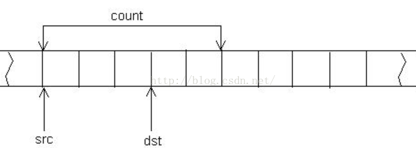
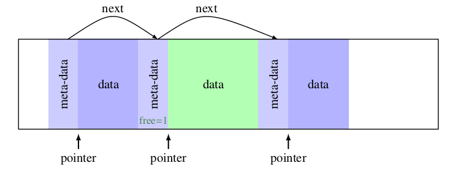

很多东西记不清了
# C/C++ memmove与memcpy的区别及实现

1. 与字符串函数strcpy区别：
- memcpy与memmove都是对内存进行拷贝可以拷贝任何内容，而strcpy仅是对字符串进行操作。
- memcpy与memmove拷贝多少是通过其第三个参数进行控制而strcpy是当拷贝至'\0'停止。

2. 函数说明：         

- memcpy函数的功能是从源src所指的内存地址的起始位置开始拷贝N个字节到目标dst所指的内存地址的起始位置中。
- memmove函数的功能同memcpy基本一致，但是当src区域和dst内存区域重叠时，memcpy可能会出现错误，而memmove能正确进行拷贝。

3. 拷贝情况：
拷贝的具体过程根据dst内存区域和src内存区域可分为三种情况：
- 当src内存区域和dst内存区域完全不重叠

- 当src内存区域和dest内存区域重叠时且dst所在区域在src所在区域前

- 当src内存区域和dst内存区域重叠时且src所在区域在dst所在区域前


上述三种情况，memcpy可以成功对前两种进行拷贝，对第三种情况进行拷贝时，由于拷贝dst前两个字节时覆盖了src原来的内容，所以接下来的拷贝会出现错误。而memmove对第三种情况进行拷贝时会从src的最后向前拷贝N个字节，避免了覆盖原来内容的过程。

4. 代码实现
```
memcpy:

void* _memcpy(void* dest, const void* src, size_t count)
{
	assert(src != nullptr&&dest != nullptr);
	//判断dest指针和src指针是否为空，若为空抛出异常
	char* tmp_dest = (char*)dest;
	const char* tmp_src = (const char*)src;
	//将指针dest和指针src由void强转为char，
	//使得每次均是对内存中的一个字节进行拷贝
	while (count--)
		*tmp_dest++ = *tmp_src++;
	return dest;
}
```
```
memmove:

void* _memmove(void* dest, const void* src, size_t count)
{
	assert(src != nullptr&&dest != nullptr);
	//判断dest指针和src指针是否为空，若为空抛出异常
	char* tmp_dest = (char*)dest;
	const char* tmp_src = (const char*)src;

	if (tmp_src < tmp_dest)//当src地址小于dest地址时，从头进行拷贝
		while (count--)
			*tmp_dest++ = *tmp_src++;
	else if (tmp_src > tmp_dest)//当src地址大于dest地址时，从后进行拷贝
	{
		tmp_src += count - 1;
		tmp_dest += count - 1;
		while (count--)
			*tmp_dest-- = *tmp_src;
	}
	//else(tmp_src==tmp_dest) 此时不进行任何操作
	return dest;
}
```

# malloc的过程（原理，机制）
一、malloc的工作机制 
　　它有一个将可用的内存块连接为一个长长的列表的所谓空闲链表。 

　　调用malloc函数时，它沿连接表寻找一个大到足以满足用户请求所需要的内存块。然后，将该内存块一分为二（一块的大小与用户请求的大小相等，另一块的大小就是剩下的字节）。接下来，将分配给用户的那块内存传给用户，并将剩下的那块（如果有的话）返回到连接表上。 

　　调用free函数时，它将用户释放的内存块连接到空闲链上。到最后，空闲链会被切成很多的小内存片段，如果这时用户申请一个大的内存片段，那么空闲链上可能没有可以满足用户要求的片段了。于是，malloc函数请求延时，并开始在空闲链上翻箱倒柜地检查各内存片段，对它们进行整理，将相邻的小空闲块合并成较大的内存块。 
　　 
　　glibc维护了不止一个不定长的内存块链表，而是好几个，每一个这种链表负责一个大小范围，这种做法有效减少了分配大内存时的遍历开销 
　　glibc另外的策略就是不止维护一类空闲链表，而是另外再维护一个缓冲链表和一个高速缓冲链表。 
　　在分配的时候首先在高速缓存中查找，失败之后再在空闲链表查找，如果找到的内存块比较大，那么将切割之后的剩余内存块插入到缓存链表。 
　　如果空闲链表查找失败那么就往缓存链表中查找. 如果还是没有合适的空闲块，就向内存申请比请求数更大的内存块，然后把剩下的内存放入链表中。

　　在对内存块进行了 free 调用之后，我们需要做的是诸如将它们标记为未被使用的等事情，并且，在调用 malloc 时，我们要能够定位未被使用的内存块。因此， malloc返回的每块内存的起始处首先要有这个结构：
```
struct mem_control_block {
    int is_available;
    int size;
};
```
二、sbrk & brk 
　　malloc所申请的内存主要从Heap区域分配（本文不考虑通过mmap申请大块内存的情况）。

　　进程所面对的虚拟内存地址空间，只有按页映射到物理内存地址，才能真正使用。受物理存储容量限制，整个堆虚拟内存空间不可能全部映射到实际的物理内存。Linux对堆的管理示意如下： 


Linux维护一个break指针，这个指针指向堆空间的某个地址。从堆起始地址到break之间的地址空间为映射好的，可以供进程访问；而从break往上，是未映射的地址空间，如果访问这段空间则程序会报错。 

　　由上文知道，要增加一个进程实际的可用堆大小，就需要将break指针向高地址移动。Linux通过brk和sbrk系统调用操作break指针。两个系统调用的原型如下：
```
int brk(void *addr);
void *sbrk(intptr_t increment);
```
　　brk将break指针直接设置为某个地址，而sbrk将break从当前位置移动increment所指定的增量。brk在执行成功时返回0，否则返回-1并设置errno为ENOMEM；sbrk成功时返回break移动之前所指向的地址，否则返回(void *)-1。

　　一个小技巧是，如果将increment设置为0，则可以获得当前break的地址。

　　另外需要注意的是，由于Linux是按页进行内存映射的，所以如果break被设置为没有按页大小对齐，则系统实际上会在最后映射一个完整的页，从而实际已映射的内存空间比break指向的地方要大一些。但是使用break之后的地址是很危险的（尽管也许break之后确实有一小块可用内存地址）。 
　　 
　　注意大部份UNIX虚拟内存的使用是只增不减的。

```
CODE:malloc(32 * 1024) --->;sbrk += 32 * 1024
free()    --->;sbrk 不减少。
但如如果再来一次
malloc(32 * 1024) ---->;sbrk 也不增，使用原有空间.
但对于LINUX来说它是要以内存的最大数收缩的；
CODE:<code>
a = malloc(32 * 1024) -->;sbrk += 32 * 1024
b = malloc(32 * 1024) -->;sbrk += 32 * 1024
if(****){
free(b); --->;sbrk -= 32 * 1024;
}
else{
free(a); --->;sbrk 不减少。只是多了个空洞.
}
```

## kmalloc与vmalloc

　　　　在设备驱动程序或者内核模块中动态开辟内存，不是用malloc，而是kmalloc ,vmalloc，释放内存用的是kfree,vfree，kmalloc函数返回的是虚拟地址(线性地址). kmalloc特殊之处在于它分配的内存是物理上连续的,这对于要进行DMA的设备十分重要. 而用vmalloc分配的内存只是线性地址连续,物理地址不一定连续,不能直接用于DMA。vmalloc函数的工作方式类似于kmalloc，只不过前者分配的内存虚拟地址是连续的，而物理地址则无需连续。通过vmalloc获得的页必须一个一个地进行映射，效率不高， 因此，只在不得已(一般是为了获得大块内存)时使用。vmalloc函数返回一个指针，指向逻辑上连续的一块内存区，其大小至少为size。在发生错误 时，函数返回NULL。vmalloc可能睡眠，因此，不能从中断上下文中进行调用，也不能从其它不允许阻塞的情况下调用。要释放通过vmalloc所获 得的内存，应使用vfree函数

vmalloc和kmalloc的分配内存的wobenlai 区别大概可总结为：

1，vmalloc分配的一般为高端内存，只有当内存不够的时候才分配低端内存；kmallco从低端内存分配。

2，vmalloc分配的物理地址一般不连续，而kmalloc分配的地址连续，两者分配的虚拟地址都是连续的；

3，vmalloc分配的一般为大块内存，而kmaooc一般分配的为小块内存，（一般不超过128k);
# 多核多线程互斥问题

# 模板类能否分离编译
1. 分离编译模式
一个程序（项目）由若干个源文件共同实现，而每个源文件单独编译生成目标文件，最后将所有目标文件连接起来形成单一的可执行文件的过程成为分离编译模式。

2. 使用模板在连接时出错
在C++程序设计中，在一个源文件中定义某个函数，然后在另一个源文件中使用该函数，这是一种非常普遍的做法。但是，如果定义和调用一个函数模板时也采用这种方式，会发生编译错误。

下面的程序由三个文件组成：func.h用来对函数模板进行申明，func.cpp用来定义函数模板，main.cpp包含func.h头文件并调用相应的函数模板。
```
/***func.h***/
template<class T> void func(const T&);
/***end func.h***/

/***func.cpp***/
#include <iostream>
using namespace std;

#include "func.h"
template<class T> void func(const T& t){
    cout<<t<<endl;
}
/***end func.cpp***/

/***main.cpp***/
#include <stdio.h>
#include "func.h"

int main()
{
    func(3);
    getchar();
}
/***end main.cpp***/
```
这是一个结构非常清晰的程序，但是它不能通过编译。在VS2012下的出错信息是：
```
error LNK2019: 无法解析的外部符号 "void __cdecl func< int>(int const &)" (??$func@H@@YAXABH@Z)
```
这是怎么回事呢？

原因出现在分离编译模式上。在分离编译模式下，func.cpp会生成一个目标文件为func.obj，由于在func.cpp文件中，并没有发生函数模板调用，所以不会将函数模板func< T>实例化为模板函数func< int>，也就是说，在func.obj中无法找到关于模板函数func< int>的实现代码。在源文件main.cpp中，虽然函数模板被调用，但由于没有模板代码，也不能将其实例化。也就是说，在main.obj中也找不到模板函数func< int>的实现代码。这样，在连接的时候就会出现func< int>没有定义的错误。

3. 解决办法
3.1 将函数模板的定义放到头文件中

一个简单的解决办法就是将函数模板func< T>的定义写到头文件func.h中。这样的话，只要包含了这个头文件，就会把函数模板的代码包含进来，一旦发生函数调用，就可以依据函数模板代码将其实例化。

这个办法虽然简单可行，但是有如下不足。

（1）函数模板的定义写进了头文件，暴露了函数模板的实现细节。
（2）不符合分离编译模式的规则，因为分离编译模式要求函数原型申明放在头文件，定义放在源文件。

注意：这样做，如果在多个目标文件中存在相同的函数模板实例化后的模板函数实体，连接时并不会报函数重定义的错误，这与普通函数不同，是C++对模板函数的特殊规定。

3.2 仍然采用分离编译模式
有什么办法可以让函数模板实例化时能够找到相应的模板函数的代码呢？一个可能的解决办法就是使用关键字export。也就是说，在func.cpp里定义函数模板的时候，将函数模板头写成：
```
export template<class T> void func(const T& t);
```
这样做的目的是告诉编译器，这个函数模板可能再其他源文件中被实例化。这是一个对程序员来说负担最轻的解决办法，但是，目前几乎所有的编译器都不支持关键字export，包括VC++和GNU C++。

3.3 显示实例化
显示实例化也称为外部实例化。在不发生函数调用的时候将函数模板实例化，或者在不使用类模板的时候将类模板实例化称之为模板显示实例化。

上面遇到的问题是main.obj和func.obj中找不到模板函数func< int>的实现代码，那么就在func.cpp中将函数模板func< T>显示实例化为模板函数func< int>。

template void func<int>(cons tint&);//函数模板显示实例化
1
这样，就可以在func.cpp产生模板函数func< int>的实例化代码，编译之后就会产生函数的二进制代码，供其它源文件连接，程序就可以正常运行。当类模板的成员函数的实现定义在源文件中，通过模板类的对象调用成员函数时也会出现找不到函数定义的错误，可以使用同样的方法解决，不再赘述。

# C/C++内存泄漏及检测
## 内存泄漏简介及后果

wikipedia中这样定义内存泄漏：在计算机科学中，内存泄漏指由于疏忽或错误造成程序未能释放已经不再使用的内存的情况。内存泄漏并非指内存在物理上的消失，而是应用程序分配某段内存后，由于设计错误，导致在释放该段内存之前就失去了对该段内存的控制，从而造成了内存的浪费。

最难捉摸也最难检测到的错误之一是内存泄漏，即未能正确释放以前分配的内存的 bug。 只发生一次的小的内存泄漏可能不会被注意，但泄漏大量内存的程序或泄漏日益增多的程序可能会表现出各种征兆：从性能不良（并且逐渐降低）到内存完全用尽。 更糟的是，泄漏的程序可能会用掉太多内存，以致另一个程序失败，而使用户无从查找问题的真正根源。 此外，即使无害的内存泄漏也可能是其他问题的征兆。

内存泄漏会因为减少可用内存的数量从而降低计算机的性能。最终，在最糟糕的情况下，过多的可用内存被分配掉导致全部或部分设备停止正常工作，或者应用程序崩溃。内存泄漏可能不严重，甚至能够被常规的手段检测出来。在现代操作系统中，一个应用程序使用的常规内存在程序终止时被释放。这表示一个短暂运行的应用程序中的内存泄漏不会导致严重后果。

在以下情況，内存泄漏导致较严重的后果：

	程序运行后置之不理，并且随着时间的流失消耗越来越多的内存（比如服务器上的后台任务，尤其是嵌入式系统中的后台任务，这些任务可能被运行后很多年内都置之不理）；
	新的内存被频繁地分配，比如当显示电脑游戏或动画视频画面时；
	程序能够请求未被释放的内存（比如共享内存），甚至是在程序终止的时候；
	泄漏在操作系统内部发生；
	泄漏在系统关键驱动中发生；
	内存非常有限，比如在嵌入式系统或便携设备中；
	当运行于一个终止时内存并不自动释放的操作系统（比如AmigaOS）之上，而且一旦丢失只能通过重启来恢复。

下面我们通过以下例子来介绍如何检测内存泄漏问题：
```
#include <stdlib.h>
#include <iostream>
using namespace std;
 
void GetMemory(char *p, int num)
{
    p = (char*)malloc(sizeof(char) * num);//使用new也能够检测出来
}
 
int main(int argc,char** argv)
{
    char *str = NULL;
    GetMemory(str, 100);
    cout<<"Memory leak test!"<<endl;
    //如果main中存在while循环调用GetMemory
    //那么问题将变得很严重
    //while(1){GetMemory(...);}
    return 0;
}
```
实际中不可能这么简单，如果这么简单也用不着别的方法，程序员一眼就可以看出问题，此程序只用于测试。
## Windows平台下的内存泄漏检测
1. 检测是否存在内存泄漏问题

Windows平台下面Visual Studio 调试器和 C 运行时 (CRT) 库为我们提供了检测和识别内存泄漏的有效方法，原理大致如下：内存分配要通过CRT在运行时实现，只要在分配内存和释放内存时分别做好记录，程序结束时对比分配内存和释放内存的记录就可以确定是不是有内存泄漏。在vs中启用内存检测的方法如下：

- STEP1，在程序中包括以下语句： （#include 语句必须采用上文所示顺序。 如果更改了顺序，所使用的函数可能无法正常工作。）
```
#define _CRTDBG_MAP_ALLOC
#include <stdlib.h>
#include <crtdbg.h>
```
通过包括 crtdbg.h，将 malloc 和 free 函数映射到它们的调试版本，即 _malloc_dbg 和 _free_dbg，这两个函数将跟踪内存分配和释放。 此映射只在调试版本（在其中定义了_DEBUG）中发生。 发布版本使用普通的 malloc 和 free 函数。

define 语句将 CRT 堆函数的基版本映射到对应的“Debug”版本。 并非绝对需要该语句；但如果没有该语句，内存泄漏转储包含的有用信息将较少。

- STEP2， 在添加了上述语句之后，可以通过在程序中包括以下语句（通常应恰好放在程序退出位置之前）来转储内存泄漏信息：
```
_CrtDumpMemoryLeaks();
```
此时，完整的代码如下：
```
#define _CRTDBG_MAP_ALLOC
#include <stdlib.h>
#include <crtdbg.h>
 
#include <iostream>
using namespace std;
 
void GetMemory(char *p, int num)
{
    p = (char*)malloc(sizeof(char) * num);
}
 
int main(int argc,char** argv)
{
    char *str = NULL;
    GetMemory(str, 100);
    cout<<"Memory leak test!"<<endl;
    _CrtDumpMemoryLeaks();
    return 0;
}
```
当在调试器下运行程序时，_CrtDumpMemoryLeaks 将在“输出”窗口中显示内存泄漏信息。 内存泄漏信息如下所示：

如果没有使用 #define _CRTDBG_MAP_ALLOC 语句，内存泄漏转储将如下所示：

未定义 _CRTDBG_MAP_ALLOC 时，所显示的会是：

- 内存分配编号（在大括号内）。

- 块类型（普通、客户端或 CRT）

	“普通块”是由程序分配的普通内存。

	“客户端块”是由 MFC 程序用于需要析构函数的对象的特殊类型内存块。 MFC new 操作根据正在创建的对象的需要创建普通块或客户端块。

	“CRT 块”是由 CRT 库为自己使用而分配的内存块。 CRT 库处理这些块的释放，因此您不大可能在内存泄漏报告中看到这些块，除非出现严重错误（例如 CRT 库损坏）。

	从不会在内存泄漏信息中看到下面两种块类型：

	“可用块”是已释放的内存块。

	“忽略块”是您已特别标记的块，因而不出现在内存泄漏报告中。
- 十六进制形式的内存位置。

- 以字节为单位的块大小。

- 前 16 字节的内容（亦为十六进制）。

定义了 _CRTDBG_MAP_ALLOC 时，还会显示在其中分配泄漏的内存的文件。 文件名后括号中的数字（本示例中为 10）是该文件中的行号。

注意：如果程序总是在同一位置退出，调用 _CrtDumpMemoryLeaks 将非常容易。 如果程序从多个位置退出，则无需在每个可能退出的位置放置对 _CrtDumpMemoryLeaks 的调用，而可以在程序开始处包含以下调用：
```
_CrtSetDbgFlag ( _CRTDBG_ALLOC_MEM_DF | _CRTDBG_LEAK_CHECK_DF );
```
该语句在程序退出时自动调用 _CrtDumpMemoryLeaks。 必须同时设置 _CRTDBG_ALLOC_MEM_DF 和 _CRTDBG_LEAK_CHECK_DF 两个位域，如前面所示。

2. 定位具体的内存泄漏地方
通过上面的方法，我们几乎可以定位到是哪个地方调用内存分配函数malloc和new等，如上例中的GetMemory函数中，即第10行！但是不能定位到，在哪个地方调用GetMemory()导致的内存泄漏，而且在大型项目中可能有很多处调用GetMemory。如何要定位到在哪个地方调用GetMemory导致的内存泄漏？

定位内存泄漏的另一种技术涉及在关键点对应用程序的内存状态拍快照。 CRT 库提供一种结构类型 _CrtMemState，您可用它存储内存状态的快照：
```
_CrtMemState s1, s2, s3;
```
若要在给定点对内存状态拍快照，请向 _CrtMemCheckpoint 函数传递 _CrtMemState 结构。 该函数用当前内存状态的快照填充此结构：
```
_CrtMemCheckpoint( &s1 );
```
通过向 _CrtMemDumpStatistics 函数传递 _CrtMemState 结构，可以在任意点转储该结构的内容：
```
_CrtMemDumpStatistics( &s1 );
```
若要确定代码中某一部分是否发生了内存泄漏，可以在该部分之前和之后对内存状态拍快照，然后使用 _CrtMemDifference 比较这两个状态：
```
_CrtMemCheckpoint( &s1 );
// memory allocations take place here
_CrtMemCheckpoint( &s2 );

if ( _CrtMemDifference( &s3, &s1, &s2) )
   _CrtMemDumpStatistics( &s3 );
```
顾名思义，_CrtMemDifference 比较两个内存状态（s1 和 s2），生成这两个状态之间差异的结果（s3）。 在程序的开始和结尾放置 _CrtMemCheckpoint 调用，并使用_CrtMemDifference 比较结果，是检查内存泄漏的另一种方法。 如果检测到泄漏，则可以使用 _CrtMemCheckpoint 调用通过二进制搜索技术来划分程序和定位泄漏。

如上面的例子程序我们可以这样来定位确切的调用GetMemory的地方：
```
#define _CRTDBG_MAP_ALLOC
#include <stdlib.h>
#include <crtdbg.h>
 
#include <iostream>
using namespace std;
 
_CrtMemState s1, s2, s3;
 
void GetMemory(char *p, int num)
{
    p = (char*)malloc(sizeof(char) * num);
}
 
int main(int argc,char** argv)
{
    _CrtMemCheckpoint( &s1 );
    char *str = NULL;
    GetMemory(str, 100);
    _CrtMemCheckpoint( &s2 );
    if ( _CrtMemDifference( &s3, &s1, &s2) )
        _CrtMemDumpStatistics( &s3 );
    cout<<"Memory leak test!"<<endl;
    _CrtDumpMemoryLeaks();
    return 0;
}
```
调试时，程序输出如下结果：


# Linux平台下的内存泄漏检测
在上面我们介绍了，vs中在代码中“包含crtdbg.h，将 malloc 和 free 函数映射到它们的调试版本，即 _malloc_dbg 和 _free_dbg，这两个函数将跟踪内存分配和释放。 此映射只在调试版本（在其中定义了_DEBUG）中发生。 发布版本使用普通的 malloc 和 free 函数。”即为malloc和free做了钩子，用于记录内存分配信息。

Linux下面也有原理相同的方法——mtrace，http://en.wikipedia.org/wiki/Mtrace。方法类似，我这就不具体描述，参加给出的链接。这节我主要介绍一个非常强大的工具valgrind。如下图所示：

如上图所示知道：

==6118== 100 bytes in 1 blocks are definitely lost in loss record 1 of 1 
==6118==    at 0x4024F20: malloc (vg_replace_malloc.c:236) 
==6118==    by 0x8048724: GetMemory(char*, int) (in /home/netsky/workspace/a.out) 
==6118==    by 0x804874E: main (in /home/netsky/workspace/a.out)

是在main中调用了GetMemory导致的内存泄漏，GetMemory中是调用了malloc导致泄漏了100字节的内存。

	Things to notice: 
	• There is a lot of information in each error message; read it carefully. 
	• The 6118 is the process ID; it’s usually unimportant. 
	• The first line ("Heap Summary") tells you what kind of error it is. 
	• Below the first line is a stack trace telling you where the problem occurred. Stack traces can get quite large, and be 
	confusing, especially if you are using the C++ STL. Reading them from the bottom up can help.

	• The code addresses (eg. 0x4024F20) are usually unimportant, but occasionally crucial for tracking down weirder 
	bugs.

	The stack trace tells you where the leaked memory was allocated. Memcheck cannot tell you why the memory leaked, 
	unfortunately. (Ignore the "vg_replace_malloc.c", that’s an implementation detail.) 
	There are several kinds of leaks; the two most important categories are: 
	• "definitely lost": your program is leaking memory -- fix it! 
	• "probably lost": your program is leaking memory, unless you’re doing funny things with pointers (such as moving 
	them to point to the middle of a heap block)

# 总结
其实内存泄漏的原因可以概括为：调用了malloc/new等内存申请的操作，但缺少了对应的free/delete，总之就是，malloc/new比free/delete的数量多。我们在编程时需要注意这点，保证每个malloc都有对应的free，每个new都有对应的deleted！！！平时要养成这样一个好的习惯。

要避免内存泄漏可以总结为以下几点：

程序员要养成良好习惯，保证malloc/new和free/delete匹配；
检测内存泄漏的关键原理就是，检查malloc/new和free/delete是否匹配，一些工具也就是这个原理。要做到这点，就是利用宏或者钩子，在用户程序与运行库之间加了一层，用于记录内存分配情况。

# 如何运行时调试

# C++中引用传递与指针传递的区别
精简版：

指针：变量，独立，可变，可空，替身，无类型检查；

引用：别名，依赖，不变，非空，本体，有类型检查；

完整版：

1. 概念

　　指针从本质上讲是一个变量，变量的值是另一个变量的地址，指针在逻辑上是独立的，它可以被改变的，包括指针变量的值（所指向的地址）和指针变量的值对应的内存中的数据（所指向地址中所存放的数据）。

　　引用从本质上讲是一个别名，是另一个变量的同义词，它在逻辑上不是独立的，它的存在具有依附性，所以引用必须在一开始就被初始化（先有这个变量，这个实物，这个实物才能有别名），而且其引用的对象在其整个生命周期中不能被改变，即自始至终只能依附于同一个变量（初始化的时候代表的是谁的别名，就一直是谁的别名，不能变）。
2. C++中的指针参数传递和引用参数传递

　　指针参数传递本质上是值传递，它所传递的是一个地址值。值传递过程中，被调函数的形式参数作为被调函数的局部变量处理，会在栈中开辟内存空间以存放由主调函数传递进来的实参值，从而形成了实参的一个副本（替身）。值传递的特点是，被调函数对形式参数的任何操作都是作为局部变量进行的，不会影响主调函数的实参变量的值（形参指针变了，实参指针不会变）。

　　引用参数传递过程中，被调函数的形式参数也作为局部变量在栈中开辟了内存空间，但是这时存放的是由主调函数放进来的实参变量的地址。被调函数对形参（本体）的任何操作都被处理成间接寻址，即通过栈中存放的地址访问主调函数中的实参变量（根据别名找到主调函数中的本体）。因此，被调函数对形参的任何操作都会影响主调函数中的实参变量。

　　引用传递和指针传递是不同的，虽然他们都是在被调函数栈空间上的一个局部变量，但是任何对于引用参数的处理都会通过一个间接寻址的方式操作到主调函数中的相关变量。而对于指针传递的参数，如果改变被调函数中的指针地址，它将应用不到主调函数的相关变量。如果想通过指针参数传递来改变主调函数中的相关变量（地址），那就得使用指向指针的指针或者指针引用。

　　从编译的角度来讲，程序在编译时分别将指针和引用添加到符号表上，符号表中记录的是变量名及变量所对应地址。指针变量在符号表上对应的地址值为指针变量的地址值，而引用在符号表上对应的地址值为引用对象的地址值（与实参名字不同，地址相同）。符号表生成之后就不会再改，因此指针可以改变其指向的对象（指针变量中的值可以改），而引用对象则不能修改。

3. 总结

相同点：

　　都是地址的概念

不同点：

　　指针是一个实体（替身）；引用只是一个别名（本体的另一个名字）

　　引用只能在定义时被初始化一次，之后不可改变，即“从一而终”；指针可以修改，即“见异思迁”；

　　引用不能为空（有本体，才有别名）；指针可以为空；

　　sizeof 引用，得到的是所指向变量的大小；sizeof 指针，得到的是指针的大小；

　　指针 ++，是指指针的地址自增；引用++是指所指变量自增；

　　引用是类型安全的，引用过程会进行类型检查；指针不会进行安全检查；
# 深拷贝手撕代码

# coredump文件不出来怎么办
在linux平台下，设置core dump文件生成的方法：
1) 在终端中输入ulimit -c 如果结果为0，说明当程序崩溃时，系统并不能生成core dump。

2) 使用ulimit -c unlimited命令，开启core dump功能，并且不限制生成core dump文件的大小。如果需要限制，加数字限制即可。ulimit - c 1024

3) 默认情况下，core dump生成的文件名为core，而且就在程序当前目录下。新的core会覆盖已存在的core。通过修改/proc/sys/kernel/core_uses_pid文件，可以将进程的pid作为作为扩展名，生成的core文件格式为core.xxx，其中xxx即为pid

4) 通过修改/proc/sys/kernel/core_pattern可以控制core文件保存位置和文件格式。例如：将所有的core文件生成到/corefile目录下，文件名的格式为core-命令名-pid-时间戳. echo "/corefile/core-%e-%p-%t" > /proc/sys/kernel/core_pattern
# 大型程序崩溃怎么定位 
